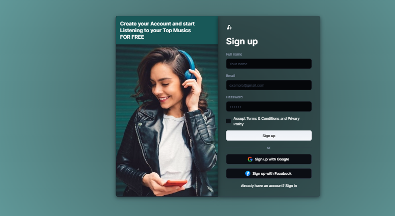

## A Sign Up Page

### Getting Started 

Welcome to the Music App Sign-Up Page, a beautifully designed authentication interface built with React and Material UI .

This app features a responsive layout, custom icons, dynamic light/dark mode, and input validation – giving users a modern experience

when creating an account to enjoy their top music for free.

### 🚀 Features
- 🎨 Light/Dark Mode Switching (using ColorModeSelect and MUI's CssVarsProvider)

- 📱 Responsive Design – Looks great on mobile, tablet, and desktop

- 🧠 Form Validation – Inline error messages for email, name, and password

- 🎵 Thematic Imagery – Includes a full-height background card with a music image

- 🔐 Third-party Auth Buttons – Google & Facebook (currently placeholders)

- ⚛️ Built with React + MUI v5 – Styled with @mui/system and styled API

### 🛠️ Tech Stack
Frontend: React

- UI Components: Material UI 

- Theming: CssBaseline, ColorModeSelect, ThemeProvider

- Icons: Custom SVGs for Google, Facebook, and Logo

- Image Assets: Stored locally (e.g., music.jpeg)

### 🙏 Acknowledgements
Grateful to everyone who played a part in making this project a success — your impact is deeply appreciated.
